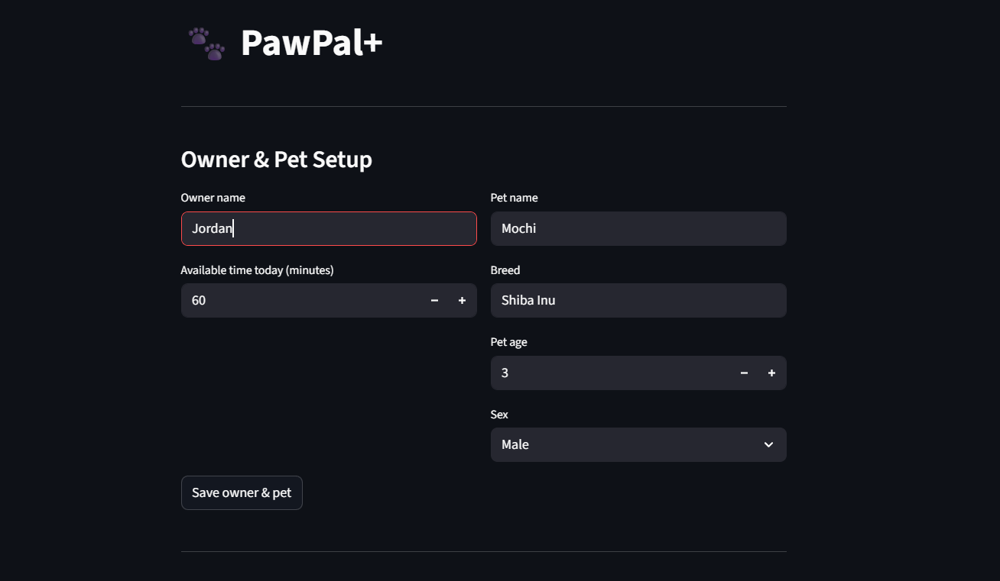

# PawPal+ (Module 2 Project)

A Streamlit app that helps busy pet owners plan and track daily care tasks for their pets — with smart scheduling, conflict detection, and automatic recurring reminders.

---

## ✨ Features

### 🗓️ Priority-based greedy scheduling
`PlanOfAction.generate_plan()` sorts all pending tasks due today by **priority descending** (`high → medium → low`), then by **shorter duration first** at equal priority, and greedily fits them into the owner's available time window starting at 8:00 AM. Tasks that don't fit are skipped without error.

### 🕐 Sorting by time
`PlanOfAction.sort_by_time(tasks)` sorts any list of `Task` objects into chronological order using each task's `preferred_time` field. The sort key converts `"HH:MM"` strings into `(hours, minutes)` integer tuples so clock ordering is always correct. Tasks with no preferred time float to the end automatically.

### 🔁 Daily & weekly recurrence
Each `Task` carries a `recurrence` field (`"daily"`, `"weekly"`, or `None`). Calling `Pet.mark_task_complete()` on a recurring task automatically appends a fresh pending copy with the next `due_date` computed via `timedelta`:
- **Daily** — `due_date = today + 1 day`
- **Weekly** — steps forward day-by-day until landing on the next matching weekday in `recurrence_days`

`Task.is_due_today()` uses `due_date` to silently exclude future occurrences from today's plan — no manual intervention needed.

### ⚠️ Conflict detection
`PlanOfAction.detect_conflicts()` scans for three types of scheduling problems and returns plain-English warning strings instead of raising exceptions:
1. **Scheduled-slot overlap** — two assigned time windows collide
2. **Preferred-time overlap** — two requested windows conflict, even if the scheduler worked around it
3. **Preferred-time mismatch** — a task asked for a specific time but was placed elsewhere

Malformed time values produce `[Warning]` messages so the rest of the scan always completes.

### 🔍 Filtering by pet or status
`Owner.filter_tasks(pet_name, status)` returns only the tasks that match the given criteria. Both parameters are optional and combinable — e.g., `filter_tasks(pet_name="Mochi", status="pending")` returns only Mochi's unfinished tasks. Non-matching pets are skipped before their task lists are scanned.

---

## 📸 Demo

> **To add your screenshot:** run `streamlit run app.py`, take a screenshot of the running app, save it as `demo.png` in this folder, then replace this block with ``.
<a href="demo.png" target="_blank"></a>.
<!--  -->

---

## Scenario

A busy pet owner needs help staying consistent with pet care. They want an assistant that can:

- Track pet care tasks (walks, feeding, meds, enrichment, grooming, etc.)
- Consider constraints (time available, priority, owner preferences)
- Produce a daily plan and explain why it chose that plan

Your job is to design the system first (UML), then implement the logic in Python, then connect it to the Streamlit UI.

## What you will build

Your final app should:

- Let a user enter basic owner + pet info
- Let a user add/edit tasks (duration + priority at minimum)
- Generate a daily schedule/plan based on constraints and priorities
- Display the plan clearly (and ideally explain the reasoning)
- Include tests for the most important scheduling behaviors

## Getting started

### Setup

```bash
python -m venv .venv
source .venv/bin/activate  # Windows: .venv\Scripts\activate
pip install -r requirements.txt
```

## Smarter Scheduling

The scheduler goes beyond a basic priority sort. Four algorithmic features were added to `pawpal_system.py`:

**Sorting by time**
`sort_by_time(tasks)` on `PlanOfAction` sorts any list of `Task` objects by their `preferred_time` attribute using a tuple key `(hours, minutes)`. Tasks without a preferred time float to the end. This lets the owner view their full task list in clock order regardless of the order tasks were added.

**Filtering by pet or status**
`filter_tasks(pet_name, status)` on `Owner` returns only the tasks that match the given criteria. Both parameters are optional and can be combined — for example, `filter_tasks(pet_name="Mochi", status="pending")` returns only Mochi's unfinished tasks. Filtering skips non-matching pets early so it never scans irrelevant task lists.

**Recurring tasks with automatic next-occurrence**
Each `Task` has a `recurrence` field (`"daily"`, `"weekly"`, or `None`). When `Pet.mark_task_complete()` is called on a recurring task, it automatically appends a fresh pending copy to the pet's task list with the correct `due_date` computed via Python's `timedelta`:
- Daily tasks: `due_date = today + timedelta(days=1)`
- Weekly tasks: steps forward day-by-day to find the next matching weekday

The scheduler's `is_due_today()` check uses `due_date` to exclude future occurrences from today's plan without any manual intervention.

**Conflict detection**
`detect_conflicts()` on `PlanOfAction` scans for three types of scheduling problems and returns a list of warning strings instead of raising exceptions:
1. **Scheduled-slot overlap** — two tasks whose actual assigned windows collide (same pet or different pets, both labelled).
2. **Preferred-time overlap** — two tasks whose requested times conflict, even if the greedy scheduler worked around it.
3. **Preferred-time mismatch** — a task that asked for a specific time but was placed elsewhere by the scheduler.

Malformed time values and missing plan data produce `[Warning]` messages rather than crashes, so the rest of the scan always completes.

---

## Testing PawPal+

### Run the test suite

```bash
python -m pytest tests/test_pawpal.py -v
```

### What the tests cover

The suite contains **10 tests** across four areas:

| Area | Tests | What is verified |
|------|-------|-----------------|
| **Task basics** | 4 | New tasks start as `pending`; `mark_complete()` flips status; `add_task()` grows the pet's task list correctly |
| **Sorting** | 2 | `sort_by_time()` returns tasks in chronological (`preferred_time`) order; tasks with no preferred time sort to the end |
| **Recurrence** | 2 | Completing a daily task appends a new pending copy due tomorrow; completing a one-time task does not create a follow-up |
| **Conflict detection** | 2 | Two tasks requesting the same time produce an overlap warning; a clean schedule with spaced-out times produces zero warnings |

### Confidence Level

**4 / 5 stars**

The core scheduling logic — priority sorting, daily recurrence, and conflict detection — is well-covered and all 10 tests pass. One star is held back because the greedy scheduling algorithm itself (e.g., tasks skipped due to insufficient time, the zero-available-time edge case) and weekly recurrence are not yet tested. The Streamlit UI layer is also untested. These are the next areas to address before considering the system fully reliable.

---

### Suggested workflow

1. Read the scenario carefully and identify requirements and edge cases.
2. Draft a UML diagram (classes, attributes, methods, relationships).
3. Convert UML into Python class stubs (no logic yet).
4. Implement scheduling logic in small increments.
5. Add tests to verify key behaviors.
6. Connect your logic to the Streamlit UI in `app.py`.
7. Refine UML so it matches what you actually built.
